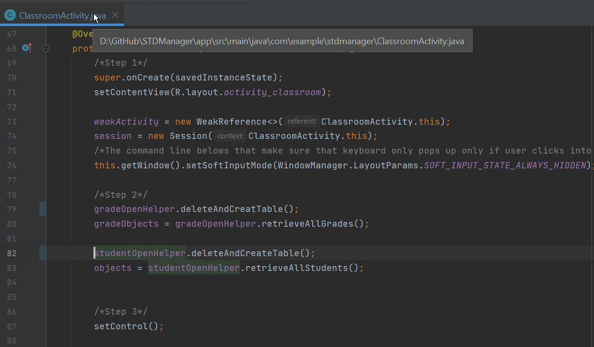
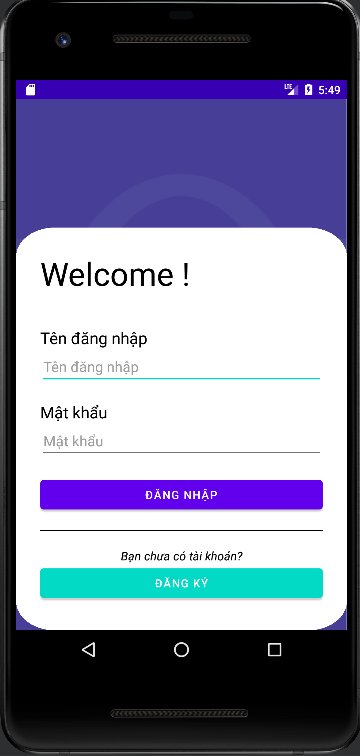
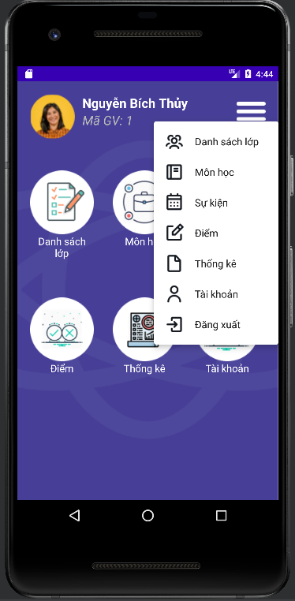
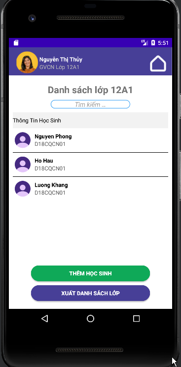
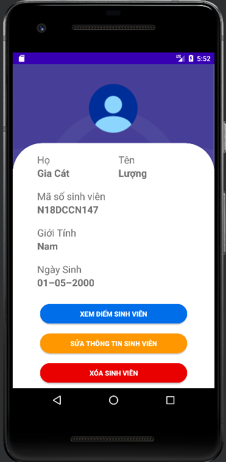
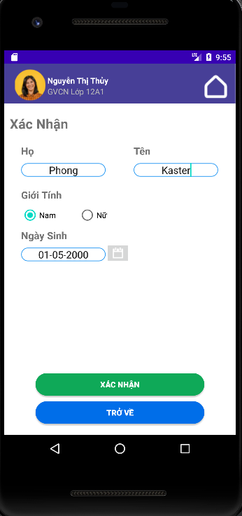

<h1 align="center">Phát Triển Ứng Dụng Cho Các Thiết Bị Di Động 
    Đồ Án Quản Lý Học Sinh/Sinh Viên
</h1>

    

# [**Table Of Content**](#table-of-content)
- [**Table Of Content**](#table-of-content)
- [**Introduction**](#introduction)
- [**Usage**](#usage)
- [**Features**](#features)
- [**Our Team**](#our-team)
- [**Made with 💘 and Java **](#made-with--and-java-)

# [**Introduction**](#introduction)

Sau đây là toàn bộ nội dung đề tài của nhóm mình tới đề tài quản lý sinh viên

    

    

    

    

    

# [**Usage**](#usage)

Để chạy được dự án này, yêu cầu Android Studio Bumblebee phiên bản 2021.1.1 Patch 2 hoặc mới hơn. Dự án này có thể tải bằng 2 cách sau đây:

- Tải về bằng `Code->Download Zip`

- Tải về bằng câu lệnh `git clone`

Sau khi tải về, để chạy được ứng dụng này cần lưu ý như sau

**Tính năng đăng nhập**

Bước 1: Truy cập `app->java->com.example.stdmanager->LoginActivity` 

Bước 2: Tìm đến dòng có số thứ tự 60 và mở khóa dòng này ra. Dòng này giúp SQLite tạo các dữ liệu ban đầu để đăng nhập 

    

<h3 align="center">

***Hàm deleteAndCreatTable() có chức năng tạo dữ liệu mặc định cho lần đầu chạy ứng dụng***
</h3>

**Tính năng quản lý sinh viên**

Bước 1: Truy cập `app->java->com.example.stdmanager->ClassroomActivity` 

Bước 2: Tìm đến dòng có số thứ tự 79 và 82, mở khóa dòng này.

# [**Features**](#features)

    

<h3 align="center">

***Đăng nhập***
</h3>

    
    &nbsp;
    

<h3 align="center">

***Trang chủ***
</h3>

    
    &nbsp;
    
    &nbsp;
    

<h3 align="center">

***Quản lý danh sách sinh viên với mỗi giáo viên làm chủ nhiệm của 1 lớp duy nhất***
</h3>

# [**Our Team**](#our-team)

<table>
        <tr>
            <td align="center">
                <a href="https://github.com/Phong-Kaster">
                    
                     
                    <b>Nguyễn Thành Phong</b>
                </a>
            </td>
            <td align="center">
                <a href="https://github.com/ngdanghau">
                    
                     
                    <b>Nguyễn Đăng Hậu</b>
                </a>
            </td>
            <td align="center">
                <a href="https://github.com/chungnv0501">
                    
                     
                    <b>Nguyễn Văn Chung</b>
                </a>
            </td>
            <td align="center">
                <a href="#">
                    
                     
                    <b>Lương Đình Khang</b>
                </a>
            </td>
            <td align="center">
                <a href="#">
                    
                     
                    <b>Hoàng Đức Thuận</b>
                </a>
            </td>
        </tr>
</table>
 
# [**Made with 💘 and Java **](#made-with-love-and-java)