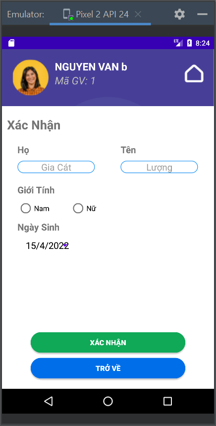
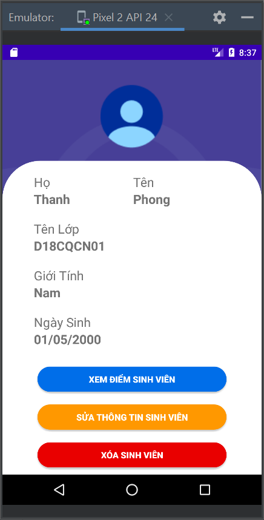
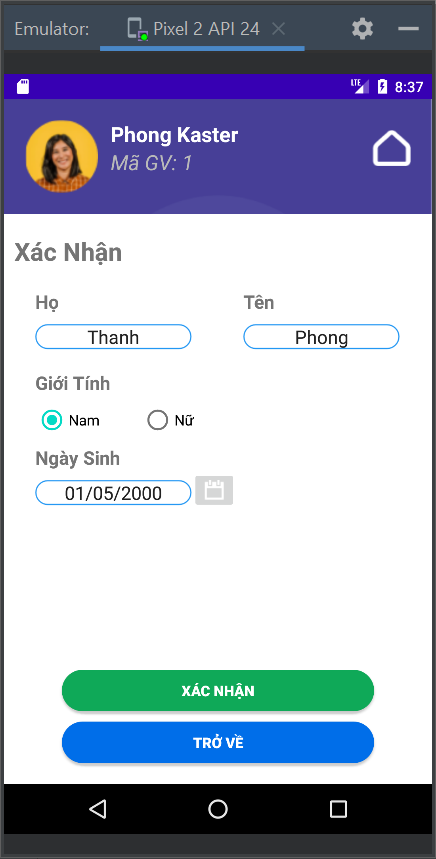

<h1 align="center">Phát Triển Ứng Dụng Cho Các Thiết Bị Di Động 
    Đồ Án Giữa Kỳ - Quản Lý Học Sinh/Sinh Viên
</h1>

    

# [**Table Of Content**](#table-of-content)
- [**Table Of Content**](#table-of-content)
- [**Introduction**](#introduction)
- [**Usage**](#usage)
- [**Base-lined Knowledge**](#base-lined-knowledge)
- [**Features**](#features)
- [**Our Team**](#our-team)
- [**Made with 💘 and Java **](#made-with--and-java-)

# [**Introduction**](#introduction)

Sau đây là toàn bộ nội dung đề tài của nhóm mình tới đề tài quản lý sinh viên

    

    

    

    

    

# [**Usage**](#usage)

Để chạy được dự án này, yêu cầu Android Studio Bumblebee phiên bản 2021.1.1 Patch 2 hoặc mới hơn. Dự án này có thể tải bằng 2 cách sau đây:

- Tải về bằng `Code->Download Zip`

- Tải về bằng câu lệnh `git clone`

Sau khi tải về, để chạy được ứng dụng này cần lưu ý như sau

**Tính năng đăng nhập**

Bước 1: Truy cập `app->java->com.example.stdmanager->LoginActivity` 

Bước 2: Tìm đến dòng có số thứ tự 60 và mở khóa dòng này ra. Dòng này giúp SQLite tạo các dữ liệu ban đầu để đăng nhập 

    

<h3 align="center">

***Hàm deleteAndCreatTable() có chức năng tạo dữ liệu mặc định cho lần đầu chạy ứng dụng***
</h3>

**Tính năng quản lý sinh viên**

Bước 1: Truy cập `app->java->com.example.stdmanager->ClassroomActivity` 

Bước 2: Tìm đến dòng có số thứ tự 79 và 82, mở khóa dòng này.

# [**Base-lined Knowledge**](#base-lined-knowledge)

Những kiến thức nền tảng được sử dụng trong đồ án này bao gồm

1. SQLite và các giao tiếp thông qua SQLiteOpenHelper

2. ListView và các tùy biến chuyên sâfa-ul

3. Tùy biến các layout với @style 

4. MenuInflater - xây dựng menu phụ trợ

5. Alert - hiển thị cảnh báo

6. Bitmap - chụp ảnh màn hình

7. Thư viện iText7 tạo tệp tin PDF 

8. Thư viện Picasso để hiển thị hình ảnh

9. Hỗ trợ tạo biểu đồ 

10. Tùy biến button với xml nằm trong `res/drawable`

11. Sử dụng Tab Host để xây dựng menu đa màn hình
# [**Features**](#features)

    

<h3 align="center">

***Đăng nhập***
</h3>

    
    &nbsp;
    

<h3 align="center">

***Trang chủ***
</h3>

    
    &nbsp;
    
    &nbsp;
    

<h3 align="center">

***Quản lý danh sách sinh viên với mỗi giáo viên làm chủ nhiệm của 1 lớp duy nhất***
</h3>

    
    &nbsp;
    

<h3 align="center">

***Xuất danh sách ra dạng JPEG và PDF***
</h3>

    
    &nbsp;
    

<h3 align="center">

***Màn hình cài đặt ứng dụng | tài khoản***
</h3>

# [**Our Team**](#our-team)

<table>
        <tr>
            <td align="center">
                <a href="https://github.com/Phong-Kaster">
                    
                     
                    <b>Nguyễn Thành Phong</b>
                </a>
            </td>
            <td align="center">
                <a href="https://github.com/ngdanghau">
                    
                     
                    <b>Nguyễn Đăng Hậu</b>
                </a>
            </td>
            <td align="center">
                <a href="https://github.com/chungnv0501">
                    
                     
                    <b>Nguyễn Văn Chung</b>
                </a>
            </td>
            <td align="center">
                <a href="#">
                    
                     
                    <b>Lương Đình Khang</b>
                </a>
            </td>
            <td align="center">
                <a href="#">
                    
                     
                    <b>Hoàng Đức Thuận</b>
                </a>
            </td>
        </tr>
</table>
 
# [**Made with 💘 and Java **](#made-with-love-and-java)